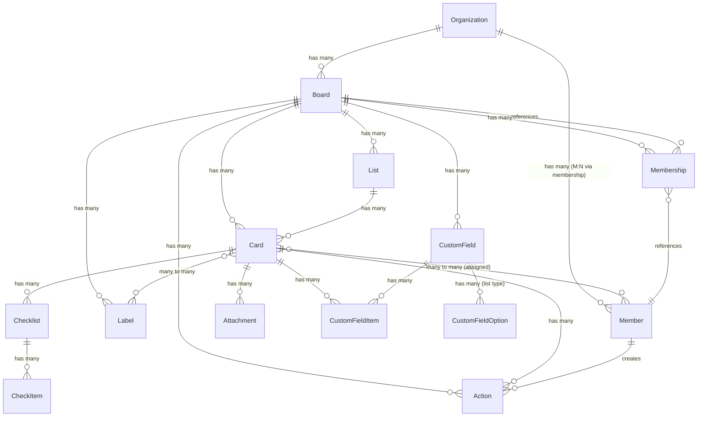

# Trello Data Model Research

> Research document for the Tauri desktop app local SQLite schema.
> Compiled: 2026-03-24

---

## Table of Contents

1. [Core Entities and Fields](#1-core-entities-and-fields)
2. [Entity Relationships](#2-entity-relationships)
3. [IDs and References](#3-ids-and-references)
4. [Actions / Activity Log](#4-actions--activity-log)
5. [Board Preferences and Settings](#5-board-preferences-and-settings)
6. [Proposed SQLite Schema](#6-proposed-sqlite-schema)
7. [Sync Strategy Considerations](#7-sync-strategy-considerations)
8. [Sources](#8-sources)

---

## 1. Core Entities and Fields

### 1.1 Board

| Field | Type | Description |
|-------|------|-------------|
| `id` | TrelloID (24-char hex) | Unique identifier |
| `name` | string | Board name |
| `desc` | string | Board description |
| `descData` | string/null | Structured description data (custom emoji) |
| `closed` | boolean | Whether the board is archived |
| `idMemberCreator` | TrelloID | Creator's member ID |
| `idOrganization` | TrelloID | Parent workspace/organization ID |
| `pinned` | boolean | Whether the user has pinned this board |
| `url` | string (URL) | Persistent full URL |
| `shortUrl` | string (URL) | Short URL using shortLink |
| `shortLink` | string (8-char) | URL-friendly short identifier |
| `starred` | boolean | Whether current user has starred this board |
| `subscribed` | boolean | Whether current user is subscribed |
| `dateLastActivity` | date | Most recent board activity |
| `dateLastView` | date | User's last view timestamp |
| `datePluginDisable` | date/null | Plugin disable date |
| `ixUpdate` | integer | Update sequence identifier |
| `prefs` | object | Board preference settings (see Section 5) |
| `labelNames` | object | Map of color keys to custom label names |
| `limits` | object | Rate/usage limit information |
| `memberships` | array | User membership objects |
| `powerUps` | array | Enabled Power-Up identifiers |
| `idTags` | array | Associated tag IDs |
| `creationMethod` | string/null | How the board was created |
| `templateGallery` | string/null | Template gallery reference |
| `enterpriseOwned` | boolean | Whether owned by an Enterprise |

### 1.2 List

| Field | Type | Description |
|-------|------|-------------|
| `id` | TrelloID (24-char hex) | Unique identifier |
| `name` | string | List name |
| `closed` | boolean | Whether the list is archived |
| `pos` | number | Position value for ordering |
| `idBoard` | TrelloID | Parent board ID |
| `softLimit` | string/null | Soft limit on cards in the list |
| `subscribed` | boolean | Whether current user is subscribed |
| `limits` | object | Limit information (e.g., attachment status) |

### 1.3 Card

| Field | Type | Description |
|-------|------|-------------|
| `id` | TrelloID (24-char hex) | Unique identifier |
| `name` | string | Card title |
| `desc` | string | Description (up to 16,384 characters) |
| `descData` | object/null | Custom emoji data |
| `closed` | boolean | Whether the card is archived |
| `pos` | float | Position value within the list |
| `idBoard` | TrelloID | Parent board ID |
| `idList` | TrelloID | Parent list ID |
| `idShort` | integer | Numeric short ID scoped to the board |
| `shortLink` | string (8-char) | URL-friendly short identifier |
| `shortUrl` | string (URL) | Short URL |
| `url` | string (URL) | Full URL including name slug |
| `due` | date/null | Due date |
| `dueComplete` | boolean | Whether due date is marked complete |
| `start` | date/null | Start date |
| `dueReminder` | string/null | Reminder settings |
| `dateLastActivity` | datetime | Last activity timestamp |
| `idMembers` | array of TrelloID | Assigned member IDs |
| `idMembersVoted` | array of TrelloID | Members who voted on this card |
| `idLabels` | array of TrelloID | Label IDs applied to the card |
| `labels` | array of Label objects | Full label objects (expanded) |
| `idChecklists` | array of TrelloID | Checklist IDs on the card |
| `idAttachmentCover` | TrelloID/null | Attachment used as cover image |
| `manualCoverAttachment` | boolean | Whether cover was manually selected |
| `cover` | object | Cover configuration: `{idAttachment, color, idUploadedBackground, size, brightness, idPlugin, isTemplate}` |
| `badges` | object | Front-of-card badge data (votes, attachments, comments, due status, etc.) |
| `checkItemStates` | array | States of checklist items |
| `subscribed` | boolean | Whether user is subscribed |
| `cardRole` | string/null | One of: `"separator"`, `"board"`, `"mirror"`, `"link"` |
| `address` | string/null | Physical address (location feature) |
| `locationName` | string/null | Location name |
| `coordinates` | object/null | Latitude/longitude |
| `email` | string | Card email address |
| `mirrorSourceId` | TrelloID/null | Source card for mirrored cards |
| `creationMethod` | string/null | How the card was created |
| `limits` | object | Rate limit information |

### 1.4 Member

| Field | Type | Description |
|-------|------|-------------|
| `id` | TrelloID (24-char hex) | Unique identifier |
| `username` | string | Unique login identifier |
| `fullName` | string | Display name |
| `initials` | string | Abbreviated initials |
| `avatarHash` | string | Hash for avatar identification |
| `avatarUrl` | string (URL) | Direct link to avatar image |
| `confirmed` | boolean | Whether email has been confirmed |
| `activityBlocked` | boolean | Whether activity is blocked |
| `idMemberReferrer` | TrelloID/null | Referrer member ID |
| `idOrganizations` | array of TrelloID | Workspaces this member belongs to |
| `idBoards` | array of TrelloID | Boards this member belongs to |
| `memberType` | string | One of: `"admin"`, `"normal"`, `"observer"` |
| `bio` | string | Member biography |
| `url` | string | Profile URL |
| `status` | string | Member status (`"disconnected"`, `"idle"`, `"active"`) |
| `nonPublic` | object | Non-public profile information |

### 1.5 Organization / Workspace

| Field | Type | Description |
|-------|------|-------------|
| `id` | TrelloID (24-char hex) | Unique identifier |
| `name` | string | URL-friendly name slug |
| `displayName` | string | Human-readable display name |
| `desc` | string | Description |
| `logoUrl` | string/null | Logo image URL |
| `logoHash` | string/null | Hash identifier for the logo |
| `activeMembershipCount` | number | Count of active members |
| `idActiveAdmins` | array of TrelloID | Admin member IDs |
| `dateLastActive` | date/null | Most recent board activity |
| `products` | array of number | Associated product identifiers |
| `prefs` | object | Organization preferences |
| `enterpriseOwned` | boolean | Whether managed by an enterprise |
| `url` | string | Organization URL |
| `website` | string | External website |

### 1.6 Label

| Field | Type | Description |
|-------|------|-------------|
| `id` | TrelloID (24-char hex) | Unique identifier |
| `idBoard` | TrelloID | Parent board ID |
| `name` | string | Label display name |
| `color` | enum/null | One of: `yellow`, `purple`, `blue`, `red`, `green`, `orange`, `black`, `sky`, `pink`, `lime`, or `null` |
| `pos` | number | Position/ordering value |

### 1.7 Checklist

| Field | Type | Description |
|-------|------|-------------|
| `id` | TrelloID (24-char hex) | Unique identifier |
| `name` | string | Checklist title |
| `idBoard` | TrelloID | Parent board ID |
| `idCard` | TrelloID | Parent card ID |
| `pos` | number | Position on the card |
| `checkItems` | array | Array of CheckItem objects |

### 1.8 CheckItem

| Field | Type | Description |
|-------|------|-------------|
| `id` | TrelloID (24-char hex) | Unique identifier |
| `idChecklist` | TrelloID | Parent checklist ID |
| `name` | string | Item text |
| `nameData` | string/null | Structured name metadata |
| `state` | enum | `"complete"` or `"incomplete"` |
| `pos` | string/number | Position/ordering value |
| `due` | date/null | Due date for the check item |
| `idMember` | TrelloID/null | Assigned member |

### 1.9 Attachment

| Field | Type | Description |
|-------|------|-------------|
| `id` | TrelloID (24-char hex) | Unique identifier |
| `name` | string | Attachment name |
| `fileName` | string | Download filename |
| `url` | string | URL to the attachment |
| `bytes` | integer | File size in bytes |
| `date` | string | Date the attachment was added |
| `edgeColor` | string | Extracted edge color for images |
| `idMember` | TrelloID | Member who added the attachment |
| `isUpload` | boolean | Whether it was uploaded (vs. linked) |
| `mimeType` | string | MIME type |
| `pos` | float | Position in attachments list |
| `previews` | array | Generated preview versions for images |

### 1.10 CustomField (Definition)

| Field | Type | Description |
|-------|------|-------------|
| `id` | TrelloID (24-char hex) | Unique identifier |
| `idModel` | TrelloID | Board ID this field belongs to |
| `modelType` | string | Always `"board"` for definitions |
| `name` | string | Display name |
| `type` | enum | One of: `"checkbox"`, `"date"`, `"list"`, `"number"`, `"text"` |
| `pos` | number | Display position |
| `fieldGroup` | string | SHA256 hash of name+type for cross-board matching |
| `display` | object | Display configuration: `{cardFront: boolean}` |
| `options` | array | Only for `list` type; each option has `{id, idCustomField, value: {text}, color, pos}` |

### 1.11 CustomFieldItem (Value)

| Field | Type | Description |
|-------|------|-------------|
| `id` | TrelloID (24-char hex) | Unique identifier |
| `idCustomField` | TrelloID | Parent field definition ID |
| `idModel` | TrelloID | Card ID holding the value |
| `modelType` | string | Always `"card"` |
| `value` | object | Type-dependent value (see below) |
| `idValue` | TrelloID | For `list` type: selected option ID |

**Value storage by type:**

| Field Type | Value Object |
|------------|-------------|
| text | `{"text": "content"}` |
| number | `{"number": "42"}` (always a string) |
| date | `{"date": "2024-03-13T16:00:00.000Z"}` |
| checkbox | `{"checked": "true"}` |
| list | No `value` field; uses `idValue` referencing an option ID |

### 1.12 Action (Comment / Activity)

| Field | Type | Description |
|-------|------|-------------|
| `id` | TrelloID (24-char hex) | Unique identifier |
| `idMemberCreator` | TrelloID | Member who caused the action |
| `type` | string | Action type (see Section 4) |
| `date` | datetime | When the action occurred |
| `data` | object | Context-specific data (see below) |
| `display` | object | Localization keys and entities |
| `memberCreator` | object | Expanded member object |
| `limits` | object | Reaction limits |

**Common `data` sub-fields:**
- `data.text` -- Comment text (for `commentCard`)
- `data.card` -- `{id, name, idShort, shortLink}`
- `data.board` -- `{id, name, shortLink}`
- `data.list` -- `{id, name}`
- `data.listBefore` / `data.listAfter` -- For move actions
- `data.old` -- Previous values (for update actions)

### 1.13 Membership (Board-Member join)

| Field | Type | Description |
|-------|------|-------------|
| `id` | TrelloID | Unique identifier |
| `idMember` | TrelloID | Member ID |
| `memberType` | string | `"admin"`, `"normal"`, or `"observer"` |
| `unconfirmed` | boolean | Whether the invitation is unconfirmed |
| `deactivated` | boolean | Whether the member is deactivated |

---

## 2. Entity Relationships

### 2.1 Relationship Diagram (Mermaid)



### 2.2 Cardinality Summary

| Relationship | Cardinality | Notes |
|-------------|-------------|-------|
| Organization -> Board | 1:N | A board belongs to one org (or none) |
| Board -> List | 1:N | Lists belong to exactly one board |
| Board -> Label | 1:N | Labels are board-scoped |
| Board -> CustomField | 1:N | Up to 50 definitions per board |
| Board -> Membership | 1:N | Each membership ties one member to one board |
| List -> Card | 1:N | A card belongs to exactly one list |
| Card -> Board | N:1 | Cards reference their board directly |
| Card <-> Member | M:N | Via `idMembers` array on card |
| Card <-> Label | M:N | Via `idLabels` array on card |
| Card -> Checklist | 1:N | Via `idChecklists` array |
| Card -> Attachment | 1:N | Attachments belong to one card |
| Card -> CustomFieldItem | 1:N | One item per custom field per card |
| Checklist -> CheckItem | 1:N | Items belong to one checklist |
| CustomField -> CustomFieldItem | 1:N | Definition to values |
| CustomField -> CustomFieldOption | 1:N | Only for list-type fields |
| Action -> Member | N:1 | `idMemberCreator` |
| Action -> Board/Card/List | N:1 | Via `data` sub-object references |
| Organization <-> Member | M:N | Via org memberships |

---

## 3. IDs and References

### 3.1 TrelloID Format

All primary identifiers follow the MongoDB ObjectId format:
- **Pattern:** `^[0-9a-fA-F]{24}$` (24-character hexadecimal string)
- **Example:** `5abbe4b7ddc1b351ef961414`
- The first 8 characters encode a Unix timestamp (creation time), meaning the ID itself encodes when the object was created.

### 3.2 Short IDs and Short Links

- **`idShort`** (cards only): A sequential integer scoped to the board. Card #1 on a board has `idShort: 1`. This is what users see as `#1`, `#2`, etc.
- **`shortLink`**: An 8-character alphanumeric string used in URLs. Unique across all of Trello.
- **`shortUrl`**: Constructed as `https://trello.com/c/{shortLink}` (cards) or `https://trello.com/b/{shortLink}` (boards).
- **`url`**: Full URL including the human-readable slug, e.g., `https://trello.com/c/{shortLink}/{name-slug}`.

### 3.3 Reference Patterns

Trello uses direct ID embedding rather than join tables:
- Cards store `idBoard`, `idList`, `idMembers[]`, `idLabels[]`, `idChecklists[]`
- Checklists store `idCard`, `idBoard`
- Check items store `idChecklist`
- Attachments are fetched via card endpoints (no direct `idCard` field exposed, but scoped to cards)
- Actions store references in their `data` object: `data.card.id`, `data.board.id`, `data.list.id`

---

## 4. Actions / Activity Log

### 4.1 Overview

Actions are Trello's immutable audit log. Every significant event produces an Action record. Actions are accessible via board, card, list, member, or organization endpoints.

### 4.2 Included Action Types (returned in nested resource requests)

These 47+ types appear in standard API responses:

| Category | Action Types |
|----------|-------------|
| **Cards** | `createCard`, `copyCard`, `emailCard`, `convertToCardFromCheckItem`, `updateCard`, `deleteCard`, `commentCard`, `copyCommentCard` |
| **Members on Cards** | `addMemberToCard`, `removeMemberFromCard` |
| **Checklists** | `addChecklistToCard`, `removeChecklistFromCard`, `updateCheckItemStateOnCard`, `updateChecklist` |
| **Attachments** | `addAttachmentToCard` |
| **Boards** | `createBoard`, `copyBoard`, `updateBoard` |
| **Board Members** | `addMemberToBoard`, `makeAdminOfBoard`, `makeNormalMemberOfBoard`, `makeObserverOfBoard` |
| **Lists** | `createList`, `updateList`, `moveListFromBoard`, `moveListToBoard` |
| **Cards Across Boards** | `moveCardFromBoard`, `moveCardToBoard` |
| **Organizations** | `createOrganization`, `updateOrganization`, `addMemberToOrganization`, `makeNormalMemberOfOrganization` |
| **Org + Board** | `addToOrganizationBoard`, `removeFromOrganizationBoard` |
| **Enterprise** | `addOrganizationToEnterprise`, `removeOrganizationFromEnterprise`, `acceptEnterpriseJoinRequest` |
| **Plugins/Power-Ups** | `enablePlugin`, `disablePlugin`, `enablePowerUp`, `disablePowerUp`, `addToEnterprisePluginWhitelist`, `removeFromEnterprisePluginWhitelist`, `enableEnterprisePluginWhitelist`, `disableEnterprisePluginWhitelist` |
| **Invitations** | `deleteBoardInvitation`, `deleteOrganizationInvitation`, `unconfirmedBoardInvitation`, `unconfirmedOrganizationInvitation` |
| **Members** | `memberJoinedTrello`, `updateMember` |

### 4.3 Excluded Action Types (webhooks only)

These 22+ types only appear in webhook payloads, not in standard API responses:

`addAdminToBoard`, `addAdminToOrganization`, `addLabelToCard`, `copyChecklist`, `createBoardInvitation`, `createBoardPreference`, `createCheckItem`, `createLabel`, `createOrganizationInvitation`, `deleteAttachmentFromCard`, `deleteCheckItem`, `deleteComment`, `deleteLabel`, `makeAdminOfOrganization`, `removeAdminFromBoard`, `removeAdminFromOrganization`, `removeLabelFromCard`, `removeMemberFromBoard`, `removeMemberFromOrganization`, `updateCheckItem`, `updateComment`, `updateLabel`, `voteOnCard`

### 4.4 Custom Field Actions (webhook only)

`addCustomField`, `deleteCustomField`, `updateCustomField`, `updateCustomFieldItem`

---

## 5. Board Preferences and Settings

The `prefs` object on a Board contains:

| Pref Key | Type | Valid Values | Description |
|----------|------|-------------|-------------|
| `permissionLevel` | string | `"private"`, `"org"`, `"public"` | Who can see the board |
| `voting` | string | `"disabled"`, `"members"`, `"observers"`, `"org"`, `"public"` | Who can vote on cards |
| `comments` | string | `"disabled"`, `"members"`, `"observers"`, `"org"`, `"public"` | Who can comment |
| `invitations` | string | `"admins"`, `"members"` | Who can invite new members |
| `selfJoin` | boolean | `true`/`false` | Whether org members can self-join |
| `cardCovers` | boolean | `true`/`false` | Whether card cover images are shown |
| `cardAging` | string | `"regular"`, `"pirate"` | Visual aging style for inactive cards |
| `calendarFeedEnabled` | boolean | `true`/`false` | Whether iCal feed is enabled |
| `background` | string | Color name or custom background ID | Board background (built-in: `blue`, `orange`, `green`, `red`, `purple`, `pink`, `lime`, `sky`, `grey`) |
| `backgroundImage` | string/null | URL | Background image URL |
| `backgroundImageScaled` | array | Scaled versions | Multiple sizes of background |
| `backgroundTile` | boolean | `true`/`false` | Whether background tiles |
| `backgroundBrightness` | string | `"dark"`, `"light"`, `"unknown"` | Brightness classification |
| `backgroundColor` | string | Hex color | Background color value |
| `canBePublic` | boolean | | Whether board can be made public |
| `canBeEnterprise` | boolean | | Whether board can be enterprise |
| `canBeOrg` | boolean | | Whether board can be org-visible |
| `canBePrivate` | boolean | | Whether board can be private |
| `canInvite` | boolean | | Whether current user can invite |
| `isTemplate` | boolean | `true`/`false` | Whether this is a template board |
| `hideVotes` | boolean | `true`/`false` | Whether vote counts are hidden |

---

## 6. Proposed SQLite Schema

### 6.1 Design Principles

1. **Normalized with pragmatic denormalization** -- M:N relationships get join tables; JSON columns store deeply nested / infrequently queried data (prefs, badges, display settings).
2. **Sync metadata on every table** -- `last_synced_at`, `local_modified_at`, `sync_status` columns enable offline-first conflict detection.
3. **Multi-user isolation** -- A `user_id` column on user-scoped tables (boards, starred status) enables multiple Trello accounts on the same machine.
4. **Soft deletes** -- Trello uses `closed` for archiving; we mirror that and add `deleted_locally` for sync.

### 6.2 CREATE TABLE Statements

```sql
-- ============================================================
-- SYNC METADATA
-- ============================================================

CREATE TABLE sync_meta (
    id              INTEGER PRIMARY KEY AUTOINCREMENT,
    user_id         TEXT NOT NULL,               -- Trello member ID of the authenticated user
    entity_type     TEXT NOT NULL,               -- 'board', 'card', etc.
    entity_id       TEXT NOT NULL,               -- TrelloID of the entity
    last_synced_at  TEXT NOT NULL,               -- ISO 8601 timestamp
    etag            TEXT,                         -- ETag or last-modified header for conditional requests
    sync_token      TEXT,                         -- Trello's incremental sync token (for actions)
    UNIQUE(user_id, entity_type, entity_id)
);

-- ============================================================
-- ORGANIZATIONS / WORKSPACES
-- ============================================================

CREATE TABLE organizations (
    id                      TEXT PRIMARY KEY,    -- TrelloID (24-char hex)
    name                    TEXT,                -- URL slug
    display_name            TEXT,
    desc                    TEXT,
    logo_url                TEXT,
    logo_hash               TEXT,
    url                     TEXT,
    website                 TEXT,
    active_membership_count INTEGER,
    enterprise_owned        INTEGER DEFAULT 0,   -- boolean
    prefs_json              TEXT,                 -- JSON blob for org prefs
    date_last_active        TEXT,                 -- ISO 8601
    -- Sync columns
    last_synced_at          TEXT,
    local_modified_at       TEXT,
    sync_status             TEXT DEFAULT 'synced' -- 'synced', 'dirty', 'conflict'
);

-- ============================================================
-- MEMBERS
-- ============================================================

CREATE TABLE members (
    id                  TEXT PRIMARY KEY,         -- TrelloID
    username            TEXT NOT NULL,
    full_name           TEXT,
    initials            TEXT,
    avatar_hash         TEXT,
    avatar_url          TEXT,
    bio                 TEXT,
    url                 TEXT,
    confirmed           INTEGER,                  -- boolean
    activity_blocked    INTEGER DEFAULT 0,        -- boolean
    member_type         TEXT,                      -- 'admin', 'normal', 'observer'
    status              TEXT,                      -- 'disconnected', 'idle', 'active'
    id_member_referrer  TEXT,
    -- Sync columns
    last_synced_at      TEXT,
    local_modified_at   TEXT,
    sync_status         TEXT DEFAULT 'synced'
);

-- Organization <-> Member (M:N)
CREATE TABLE organization_members (
    id_organization TEXT NOT NULL REFERENCES organizations(id),
    id_member       TEXT NOT NULL REFERENCES members(id),
    member_type     TEXT,                          -- 'admin', 'normal'
    PRIMARY KEY (id_organization, id_member)
);

-- ============================================================
-- BOARDS
-- ============================================================

CREATE TABLE boards (
    id                  TEXT PRIMARY KEY,          -- TrelloID
    name                TEXT NOT NULL,
    desc                TEXT,
    desc_data           TEXT,                      -- JSON
    closed              INTEGER DEFAULT 0,         -- boolean
    id_member_creator   TEXT REFERENCES members(id),
    id_organization     TEXT REFERENCES organizations(id),
    url                 TEXT,
    short_url           TEXT,
    short_link          TEXT,
    pinned              INTEGER DEFAULT 0,
    starred             INTEGER DEFAULT 0,
    subscribed          INTEGER DEFAULT 0,
    date_last_activity  TEXT,
    date_last_view      TEXT,
    date_plugin_disable TEXT,
    ix_update           INTEGER,
    enterprise_owned    INTEGER DEFAULT 0,
    -- Prefs stored as JSON (complex nested object, rarely queried by individual field)
    prefs_json          TEXT,
    -- Label names map stored as JSON
    label_names_json    TEXT,
    -- Sync columns
    last_synced_at      TEXT,
    local_modified_at   TEXT,
    sync_status         TEXT DEFAULT 'synced'
);

-- Board <-> Member (M:N via memberships)
CREATE TABLE board_memberships (
    id              TEXT PRIMARY KEY,              -- TrelloID of the membership
    id_board        TEXT NOT NULL REFERENCES boards(id),
    id_member       TEXT NOT NULL REFERENCES members(id),
    member_type     TEXT NOT NULL,                 -- 'admin', 'normal', 'observer'
    unconfirmed     INTEGER DEFAULT 0,
    deactivated     INTEGER DEFAULT 0,
    UNIQUE(id_board, id_member)
);

-- Per-user board metadata (starred, pinned, last_view are user-scoped)
CREATE TABLE user_board_prefs (
    user_id         TEXT NOT NULL,                 -- authenticated user's TrelloID
    id_board        TEXT NOT NULL REFERENCES boards(id),
    starred         INTEGER DEFAULT 0,
    pinned          INTEGER DEFAULT 0,
    subscribed      INTEGER DEFAULT 0,
    date_last_view  TEXT,
    PRIMARY KEY (user_id, id_board)
);

-- ============================================================
-- LISTS
-- ============================================================

CREATE TABLE lists (
    id              TEXT PRIMARY KEY,              -- TrelloID
    name            TEXT NOT NULL,
    closed          INTEGER DEFAULT 0,
    pos             REAL NOT NULL,
    id_board        TEXT NOT NULL REFERENCES boards(id),
    soft_limit      TEXT,
    subscribed      INTEGER DEFAULT 0,
    -- Sync columns
    last_synced_at  TEXT,
    local_modified_at TEXT,
    sync_status     TEXT DEFAULT 'synced'
);

CREATE INDEX idx_lists_board ON lists(id_board);

-- ============================================================
-- LABELS
-- ============================================================

CREATE TABLE labels (
    id              TEXT PRIMARY KEY,              -- TrelloID
    id_board        TEXT NOT NULL REFERENCES boards(id),
    name            TEXT DEFAULT '',
    color           TEXT,                          -- 'yellow','purple','blue','red','green','orange','black','sky','pink','lime', or NULL
    pos             REAL,
    -- Sync columns
    last_synced_at  TEXT,
    local_modified_at TEXT,
    sync_status     TEXT DEFAULT 'synced'
);

CREATE INDEX idx_labels_board ON labels(id_board);

-- ============================================================
-- CARDS
-- ============================================================

CREATE TABLE cards (
    id                      TEXT PRIMARY KEY,      -- TrelloID
    name                    TEXT NOT NULL,
    desc                    TEXT DEFAULT '',
    desc_data               TEXT,                   -- JSON
    closed                  INTEGER DEFAULT 0,
    pos                     REAL NOT NULL,
    id_board                TEXT NOT NULL REFERENCES boards(id),
    id_list                 TEXT NOT NULL REFERENCES lists(id),
    id_short                INTEGER,
    short_link              TEXT,
    short_url               TEXT,
    url                     TEXT,
    due                     TEXT,                   -- ISO 8601 or NULL
    due_complete            INTEGER DEFAULT 0,
    start                   TEXT,                   -- ISO 8601 or NULL
    due_reminder            TEXT,
    date_last_activity      TEXT,
    id_attachment_cover     TEXT,
    manual_cover_attachment INTEGER DEFAULT 0,
    cover_json              TEXT,                   -- JSON for cover object
    badges_json             TEXT,                   -- JSON for badges
    subscribed              INTEGER DEFAULT 0,
    card_role               TEXT,                   -- 'separator','board','mirror','link', or NULL
    address                 TEXT,
    location_name           TEXT,
    coordinates_json        TEXT,                   -- JSON {latitude, longitude}
    email                   TEXT,
    mirror_source_id        TEXT,
    creation_method         TEXT,
    -- Sync columns
    last_synced_at          TEXT,
    local_modified_at       TEXT,
    sync_status             TEXT DEFAULT 'synced'
);

CREATE INDEX idx_cards_list ON cards(id_list);
CREATE INDEX idx_cards_board ON cards(id_board);
CREATE INDEX idx_cards_due ON cards(due) WHERE due IS NOT NULL;

-- Card <-> Member (M:N assignment)
CREATE TABLE card_members (
    id_card     TEXT NOT NULL REFERENCES cards(id),
    id_member   TEXT NOT NULL REFERENCES members(id),
    PRIMARY KEY (id_card, id_member)
);

-- Card <-> Member votes (M:N)
CREATE TABLE card_votes (
    id_card     TEXT NOT NULL REFERENCES cards(id),
    id_member   TEXT NOT NULL REFERENCES members(id),
    PRIMARY KEY (id_card, id_member)
);

-- Card <-> Label (M:N)
CREATE TABLE card_labels (
    id_card     TEXT NOT NULL REFERENCES cards(id),
    id_label    TEXT NOT NULL REFERENCES labels(id),
    PRIMARY KEY (id_card, id_label)
);

-- ============================================================
-- CHECKLISTS & CHECK ITEMS
-- ============================================================

CREATE TABLE checklists (
    id              TEXT PRIMARY KEY,              -- TrelloID
    name            TEXT NOT NULL,
    id_board        TEXT NOT NULL REFERENCES boards(id),
    id_card         TEXT NOT NULL REFERENCES cards(id),
    pos             REAL,
    -- Sync columns
    last_synced_at  TEXT,
    local_modified_at TEXT,
    sync_status     TEXT DEFAULT 'synced'
);

CREATE INDEX idx_checklists_card ON checklists(id_card);

CREATE TABLE check_items (
    id              TEXT PRIMARY KEY,              -- TrelloID
    id_checklist    TEXT NOT NULL REFERENCES checklists(id),
    name            TEXT NOT NULL,
    name_data       TEXT,                          -- JSON
    state           TEXT NOT NULL DEFAULT 'incomplete', -- 'complete' or 'incomplete'
    pos             REAL,
    due             TEXT,                          -- ISO 8601 or NULL
    id_member       TEXT REFERENCES members(id),   -- assigned member
    -- Sync columns
    last_synced_at  TEXT,
    local_modified_at TEXT,
    sync_status     TEXT DEFAULT 'synced'
);

CREATE INDEX idx_check_items_checklist ON check_items(id_checklist);

-- ============================================================
-- ATTACHMENTS
-- ============================================================

CREATE TABLE attachments (
    id              TEXT PRIMARY KEY,              -- TrelloID
    id_card         TEXT NOT NULL REFERENCES cards(id),
    name            TEXT,
    file_name       TEXT,
    url             TEXT,
    bytes           INTEGER,
    date            TEXT,                          -- ISO 8601
    edge_color      TEXT,
    id_member       TEXT REFERENCES members(id),
    is_upload       INTEGER DEFAULT 0,
    mime_type       TEXT,
    pos             REAL,
    previews_json   TEXT,                          -- JSON array of preview objects
    -- Sync columns
    last_synced_at  TEXT,
    local_modified_at TEXT,
    sync_status     TEXT DEFAULT 'synced'
);

CREATE INDEX idx_attachments_card ON attachments(id_card);

-- ============================================================
-- CUSTOM FIELDS
-- ============================================================

-- Definitions (board-scoped)
CREATE TABLE custom_fields (
    id              TEXT PRIMARY KEY,              -- TrelloID
    id_model        TEXT NOT NULL REFERENCES boards(id), -- board ID
    model_type      TEXT NOT NULL DEFAULT 'board',
    name            TEXT NOT NULL,
    type            TEXT NOT NULL,                 -- 'checkbox','date','list','number','text'
    pos             REAL,
    field_group     TEXT,                          -- SHA256 hash for cross-board matching
    display_json    TEXT,                          -- JSON {cardFront: bool}
    -- Sync columns
    last_synced_at  TEXT,
    local_modified_at TEXT,
    sync_status     TEXT DEFAULT 'synced'
);

CREATE INDEX idx_custom_fields_board ON custom_fields(id_model);

-- Options for list-type custom fields
CREATE TABLE custom_field_options (
    id              TEXT PRIMARY KEY,              -- TrelloID
    id_custom_field TEXT NOT NULL REFERENCES custom_fields(id),
    value_text      TEXT,                          -- display text
    color           TEXT,
    pos             REAL
);

CREATE INDEX idx_cf_options_field ON custom_field_options(id_custom_field);

-- Values (card-scoped)
CREATE TABLE custom_field_items (
    id              TEXT PRIMARY KEY,              -- TrelloID
    id_custom_field TEXT NOT NULL REFERENCES custom_fields(id),
    id_model        TEXT NOT NULL,                 -- card ID
    model_type      TEXT NOT NULL DEFAULT 'card',
    -- Value columns: only one is populated depending on custom field type
    value_text      TEXT,
    value_number    TEXT,                          -- stored as string per Trello API
    value_date      TEXT,                          -- ISO 8601
    value_checked   TEXT,                          -- 'true' or 'false'
    id_value        TEXT REFERENCES custom_field_options(id), -- for list type
    -- Sync columns
    last_synced_at  TEXT,
    local_modified_at TEXT,
    sync_status     TEXT DEFAULT 'synced'
);

CREATE INDEX idx_cf_items_card ON custom_field_items(id_model);
CREATE INDEX idx_cf_items_field ON custom_field_items(id_custom_field);
CREATE UNIQUE INDEX idx_cf_items_unique ON custom_field_items(id_custom_field, id_model);

-- ============================================================
-- ACTIONS (Activity Log / Comments)
-- ============================================================

CREATE TABLE actions (
    id                  TEXT PRIMARY KEY,          -- TrelloID
    id_member_creator   TEXT REFERENCES members(id),
    type                TEXT NOT NULL,             -- action type string
    date                TEXT NOT NULL,             -- ISO 8601
    -- Data stored as JSON (highly variable structure per action type)
    data_json           TEXT NOT NULL,
    -- Denormalized references for efficient querying
    data_board_id       TEXT,                      -- extracted from data.board.id
    data_card_id        TEXT,                      -- extracted from data.card.id
    data_list_id        TEXT,                      -- extracted from data.list.id
    -- Display info
    display_json        TEXT,
    -- For commentCard: extracted text for full-text search
    comment_text        TEXT,
    -- Sync columns
    last_synced_at      TEXT,
    local_modified_at   TEXT,
    sync_status         TEXT DEFAULT 'synced'
);

CREATE INDEX idx_actions_board ON actions(data_board_id);
CREATE INDEX idx_actions_card ON actions(data_card_id);
CREATE INDEX idx_actions_type ON actions(type);
CREATE INDEX idx_actions_date ON actions(date);

-- ============================================================
-- STICKERS (optional, lower priority)
-- ============================================================

CREATE TABLE stickers (
    id          TEXT PRIMARY KEY,
    id_card     TEXT NOT NULL REFERENCES cards(id),
    top         INTEGER,
    left_pos    INTEGER,                           -- 'left' is reserved in SQL
    z_index     INTEGER,
    rotate      INTEGER,
    image       TEXT,
    image_url   TEXT
);

-- ============================================================
-- LOCAL-ONLY TABLES
-- ============================================================

-- Authenticated user sessions
CREATE TABLE user_sessions (
    user_id         TEXT PRIMARY KEY,              -- Trello member ID
    username        TEXT NOT NULL,
    token           TEXT NOT NULL,                 -- API token (encrypted at rest)
    token_secret    TEXT,                          -- OAuth secret if applicable
    last_login      TEXT,
    is_active       INTEGER DEFAULT 1
);

-- Pending local changes queue (for offline mutations)
CREATE TABLE pending_changes (
    id              INTEGER PRIMARY KEY AUTOINCREMENT,
    user_id         TEXT NOT NULL,
    entity_type     TEXT NOT NULL,                 -- 'card', 'list', etc.
    entity_id       TEXT,                          -- TrelloID (NULL for creates)
    operation       TEXT NOT NULL,                 -- 'create', 'update', 'delete'
    payload_json    TEXT NOT NULL,                 -- JSON of the mutation
    created_at      TEXT NOT NULL,                 -- ISO 8601
    status          TEXT DEFAULT 'pending',        -- 'pending', 'syncing', 'failed', 'synced'
    error_message   TEXT,
    retry_count     INTEGER DEFAULT 0
);

CREATE INDEX idx_pending_user ON pending_changes(user_id, status);
```

### 6.3 Schema Design Notes

**Why JSON columns for prefs/badges/cover:**
Board prefs have 15+ fields that are rarely queried individually. Storing as JSON avoids wide tables and simplifies sync (replace the whole blob). Same logic applies to card `badges`, `cover`, and `coordinates`.

**Why separate value columns for CustomFieldItem:**
Rather than a single JSON `value` column, we split into `value_text`, `value_number`, `value_date`, `value_checked`, and `id_value`. This enables type-appropriate indexing and querying (e.g., "find all cards where custom field X has a date before Y") without JSON parsing.

**Why denormalized references on Actions:**
Actions' `data` object is highly polymorphic. Extracting `data_board_id`, `data_card_id`, and `data_list_id` into indexed columns enables efficient filtering ("show me all actions for card X") without JSON queries on every row.

**Position fields (`pos`):**
Trello uses floating-point position values to allow insertion between items without renumbering. The schema uses `REAL` for these columns to preserve this behavior.

---

## 7. Sync Strategy Considerations

### 7.1 Incremental Sync via Actions

Trello does not offer a general "give me changes since timestamp" endpoint. The recommended approach:

1. **Initial full sync** -- Fetch boards, lists, cards, members, labels, checklists, attachments, custom fields for each board the user has access to.
2. **Incremental updates via Actions** -- Poll `/1/boards/{id}/actions?since={lastActionDate}` to get recent changes. Parse action types to determine which entities changed, then fetch updated entities.
3. **Webhooks (when online)** -- Register webhooks on boards to receive push notifications of changes. This reduces polling frequency.

### 7.2 Conflict Resolution

| Scenario | Strategy |
|----------|----------|
| Server changed, local unchanged | Accept server version |
| Local changed, server unchanged | Push local version |
| Both changed, same field | Last-write-wins with `dateLastActivity` comparison, or prompt user |
| Both changed, different fields | Merge non-conflicting fields |
| Deleted on server, modified locally | Flag as conflict for user resolution |

### 7.3 Sync Status State Machine

```
synced -> dirty (local edit made)
dirty -> syncing (push started)
syncing -> synced (push succeeded)
syncing -> conflict (push failed due to server change)
conflict -> synced (user resolved)
synced -> synced (server update pulled)
```

### 7.4 Offline Mutation Queue

The `pending_changes` table acts as a write-ahead log:
1. Local mutations are applied to the main tables immediately (optimistic updates) and recorded in `pending_changes`.
2. When connectivity resumes, pending changes are replayed in order.
3. Failed changes are retried with exponential backoff up to `retry_count` limit.
4. On conflict, the change status is set to `'failed'` with an error message for user review.

### 7.5 Multi-User Isolation

- The `user_sessions` table supports multiple Trello accounts.
- `user_board_prefs` partitions per-user state (starred, last viewed).
- `sync_meta` tracks sync progress per user per entity.
- Shared entity tables (boards, cards, etc.) are not partitioned by user since the same board can be accessed by multiple accounts. The sync layer must merge data correctly.

### 7.6 Performance Considerations

- **Batch fetches**: Use Trello's nested resources (`?lists=open&cards=visible&card_customFieldItems=true`) to minimize API calls.
- **Pagination**: Actions are paginated; use `before` parameter for cursor-based pagination.
- **Rate limits**: Trello allows 100 requests per 10-second window per token, and 300 per 10 seconds per API key. The sync engine must respect these limits.
- **SQLite WAL mode**: Enable `PRAGMA journal_mode=WAL` for concurrent reads during sync writes.
- **Indexes**: Focused on the most common query patterns -- cards by list, cards by board, actions by card/board, items by due date.

---

## 8. Sources

- [Trello REST API -- Boards](https://developer.atlassian.com/cloud/trello/rest/api-group-boards/)
- [Trello REST API -- Cards](https://developer.atlassian.com/cloud/trello/rest/api-group-cards/)
- [Trello REST API -- Lists](https://developer.atlassian.com/cloud/trello/rest/api-group-lists/)
- [Trello REST API -- Members](https://developer.atlassian.com/cloud/trello/rest/api-group-members/)
- [Trello REST API -- Actions](https://developer.atlassian.com/cloud/trello/rest/api-group-actions/)
- [Trello REST API -- Checklists](https://developer.atlassian.com/cloud/trello/rest/api-group-checklists/)
- [Trello REST API -- Labels](https://developer.atlassian.com/cloud/trello/rest/api-group-labels/)
- [Trello REST API -- Organizations](https://developer.atlassian.com/cloud/trello/rest/api-group-organizations/)
- [Trello REST API -- Custom Fields](https://developer.atlassian.com/cloud/trello/rest/api-group-customfields/)
- [Trello Object Definitions Guide](https://developer.atlassian.com/cloud/trello/guides/rest-api/object-definitions/)
- [Trello Action Types Guide](https://developer.atlassian.com/cloud/trello/guides/rest-api/action-types/)
- [Getting Started with Custom Fields](https://developer.atlassian.com/cloud/trello/guides/rest-api/getting-started-with-custom-fields/)
- [Trello API Action Types (Community Gist)](https://gist.github.com/manuelgu/98a8a5e443b9aed4093a)
